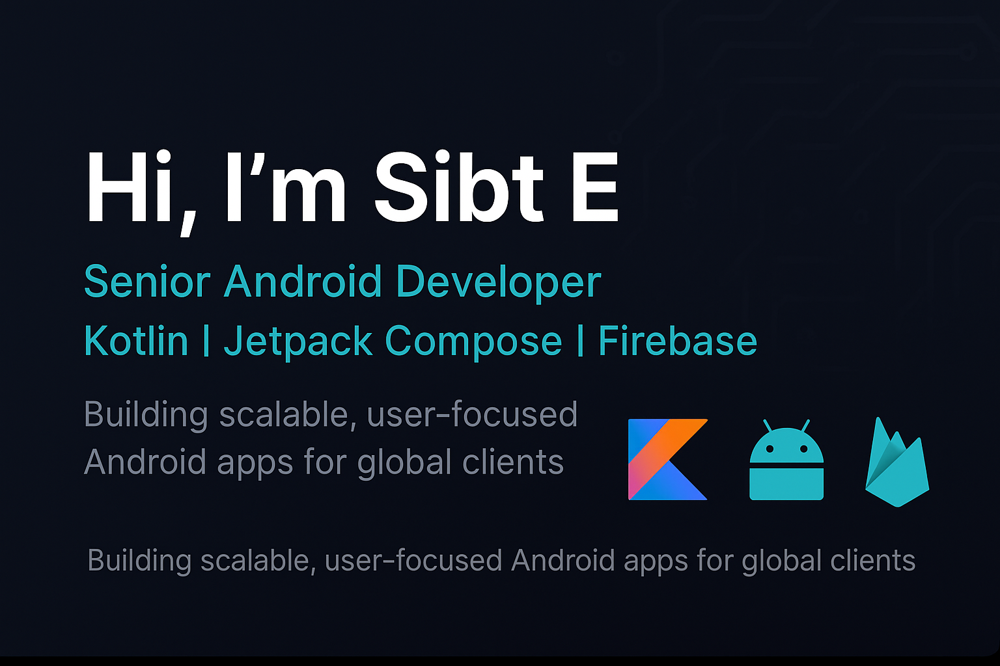

<!-- === 👋 GITHUB PROFILE README === -->

<h1 align="center">👋 Hi, I'm Sibt E</h1>
<h3 align="center">🚀 Senior Android Developer | Kotlin | Jetpack Compose | Firebase | 7+ Years Experience</h3>

---

### 🧩 About Me
I’m a **Senior Android Developer** with **7+ years** of experience designing and building robust, high-performing mobile applications.  
I specialize in **Kotlin**, **Jetpack Compose**, **Firebase**, and **Clean Architecture** — delivering modern apps with exceptional user experience.

💼 Currently seeking **full-time remote roles** in mobile app development.  
🌍 Passionate about crafting digital solutions that make everyday life easier and smarter.  
🧠 I believe in clean code, strong architecture, and continuous learning.

---

### 🛠 Tech Stack

  
  
  
  
  
  

---

### 🚀 Featured Projects

| 🧩 Project | 💬 Description | 🧠 Tech Stack |
|------------|----------------|---------------|
| **💳 Moor Digital Bank** | Production-ready banking app with KYC onboarding, biometric login & offline transactions. | Kotlin, MVVM, Firebase |
| **🚖 Joud Taxi (Women & Kids)** | Safety-first ride app with SOS, vetted drivers, and real-time tracking. | Firebase, Maps, Realtime DB |
| **🏪 Business Panda** | Marketplace platform for seller onboarding & store management. | Kotlin, Jetpack Compose |
| **🧠 Android Utilities Kit** | Kotlin helper library for scalable Android apps. | Kotlin, Coroutines |

---

### 🌱 Currently Exploring
- Advanced UI animations with **Jetpack Compose**
- Multi-module Android app architecture
- Integrating **AI APIs** into Android experiences

---

### 🤝 Connect With Me

  
  

---

⭐ *"Clean code, scalable architecture, and delightful user experiences — that’s what I build."*
